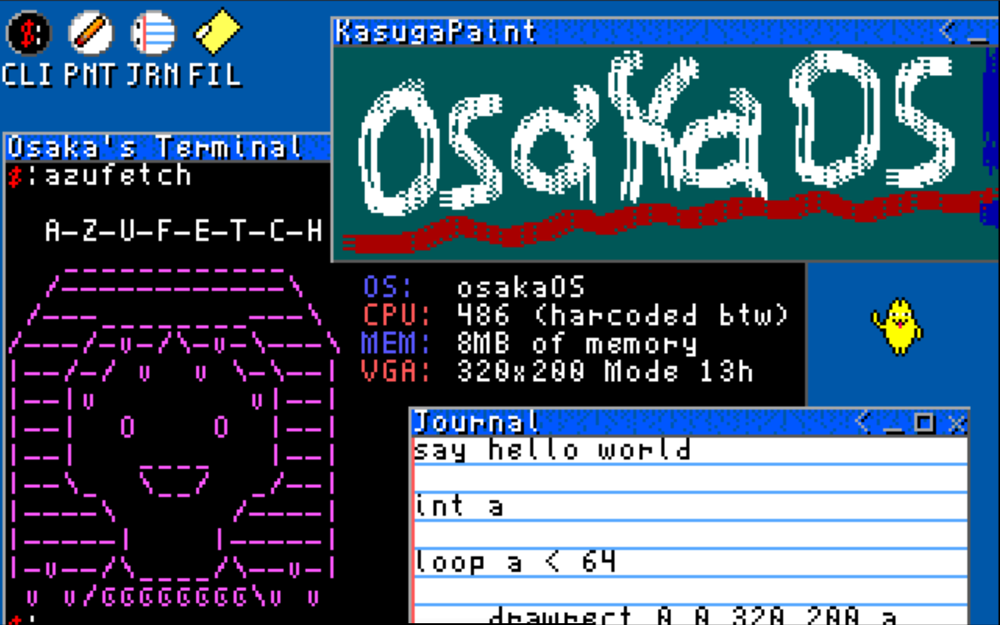
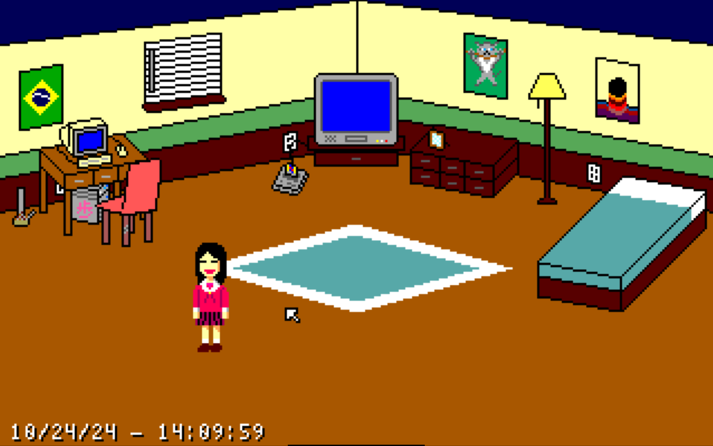

# osakaOS v2.1

<h2>The Osaka Operating System v2.1.</h2>

osakaOS is a 32 bit, (optionally) multitasking, megalithic operating system that is made with a focus on unconventional/ridiculous design choices. It is meant to emulate the experience of a videogame or demo software rather than a traditional desktop operating system. It uses different text modes and graphical programs to edit files using the <b>Osaka FileSystem</b> and create programs using the <b>AyumuScript</b> scripting language.

Multitasking kernel programs, file allocation, graphical window manipulation, a paint GUI program, and much more :)

<i>The desktop of osakaOS, you can enter the GUI by pressing the windows/command key.</i>

<h2>How to run/compile</h2>

Included is a pre-compiled bootable iso image that you can use in any normal virtualization software.
To compile from source do 'sudo make run' and pray for the best. The binary will be built and QEMU will boot from the virtual disk.

You will probably need the following software packages: g++, binutils, libc6-dev-i386, qemu-system-x86_64 grub-legacy, grub2, xorriso.

If you plan on using other emulators then make sure it has piix4 ide support for storage, at least 8MB of memory, standard VGA emulation, and pc speaker support for basic audio. Emulation is the preferred way to run the OS as running it on real hardware requires a very old machine for the drivers to work, as well as a lack of concern for the data on the machine since the OS doesn't care to ask if you want to write over a pre-existing system partition, it will just do it. There is also a lack of error catching that can cause crashes, which would be annoying to deal with on real machines.

<h2>How to get audio using PulseAudio</h2>

If you're using a linux host and use pulseaudio like me, add this line <code>load-module module-native-protocol-unix auth-anonymous=1 socket=/tmp/pulse-socket</code>
to <code>/etc/pulse/default.pa</code>. Then restart pulseaudio and the settings in the makefile should work. <a href="https://stackoverflow.com/questions/59988019/emulator-pulseaudio-access-denied">(original post here)</a>

<h2>Extra</h2>

During development this project was/will receive monthly updates on my <a href="https://www.youtube.com/@dpacarana">youtube page.</a>

This project is partly based on the <a href="https://github.com/AlgorithMan-de/wyoos">WYOOS</a> tutorial series. Although many things from the tutorial have been changed or removed for various reasons.

Current bugs may include, window input for scripts being janky, paint width being difficult, small GUI errors when drawing programs, and other stuff too long to list here. 

For the next major update I plan on further building the network stack and implement internet functionality, along with more advanced graphical applications and custom media encodings.

<i>Why did you make an entire OS after this character? Are you obsessed or something?</i>
No, I just thought it would be funny.

<h2>Important Command List</h2>

 GENERIC   
 "say (string)"   - print out whatever arguments were passed.  
 "help"           - list common commands and keyboard shortcuts. 
 "clear"          - clear text from screen. 

 DRIVERS/SYSTEM 
 "delay (int)"          - use the PIT timer to delay the system by (int) number of milliseconds. 
 "beep (int)"           - use the pc speaker to beep at (int) frequency. 
 "rmem (int)"           - read value from (int) memory address. 
 "wmem (int) (int)"     - write 2nd (int) value to 1st (int) memory address. 
 "rdisk (int) (int)"    - read from 1st (int) sector number for 2nd (int) number of bytes. 
 "wdisk (int) (string)" - write (string) data to (int) sector. 

 FILESYSTEM 
 "files"                - list all known files and number of files currently allocated. 
 "tag (string) (file)"  - assign an organizational tag (string) to given files. 
 "size (file)"          - print out size of (file) in bytes. 
 "delete (file)"        - deletes and removes (file) from filesystem. 

 AYUMUSCRIPT 
 "int (string) (int)"               - define variable with name (string) and value (int). 
 "+ (string) (int)"                 - add value (int) to variable (string). 
 "- (string) (int)"                 - subtract value (int) from variable (string). 
 "* (string) (int)"                 - multiply value (int) by variable (string). 
 "/ (string) (int)"                 - divide variable (string) by value (int). 
 "if/loop (var/int) (op) (var/int)" - determine if expression is true, if so nothing changes, if not, commands won't be processed. 
 "fi/pool"                          - allow command to be processed again. 
 "putpixel (int) (int) (int)"       - draw pixel at x and y coordinates with given color value. 
 "window (string)"                  - create user window for graphical programming. 
 "drawpic (file)"                   - fill buffer of image onto graphical target. 
 "// (string)"                      - does nothing, meant for comments in AyumuScript files. 
 "ex (file)"                        - executes files as a script (singletasking). 
 "ext (file)"                       - executes files as a script (multitasking). 

