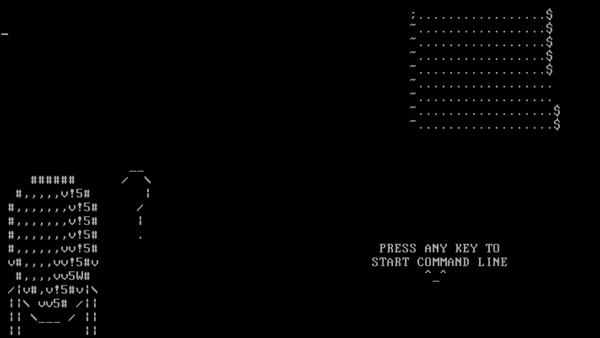

# osakaOS v1.0

<h2>THE operating system of all time.</h2>

osakaOS is a 32 bit, singletasking, megalithic operating system that is made with a focus on unconventional/ridiculous design choices. It uses a text-based command line to edit files using the <b>Osaka FileSystem</b> and create small programs using the <b>AyumuScript</b> scripting language. 

It also features small programs called 'modes' for small games and entertainment. The commands include the ability to read and write directly to memory, disk sectors, and most importantly, print ASCII art of Osaka :)

<h2>How to run/compile</h2>

Included is a pre-compiled bootable iso image that you can use in any normal virtualization software.
To compile from source do 'sudo make run' and pray for the best. The binary will be built and QEMU will boot from the virtual disk.

You will probably need the following software packages: g++, binutils, libc6-dev-i386, qemu-system-x86_64 grub-legacy, grub2, xorriso.

If you plan on using other emulators then make sure it has piix4 ide support for storage, at least 2MB of memory, and pc speaker support for basic audio. Emulation is the preferred way to run the OS as running it on real hardware requires a very old machine for the drivers to work, as well as a lack of concern for the data on the machine since the OS doesn't care to ask if you want to write over a pre-existing system partition, it will just do it. Also the OS crashes a lot (most of the time on purpose) and that would be very annoying on bare metal.

<h2>Official Manual and Documentation</h2>

An official user manual can be found on my personal website <i>Leechplus</i> at <a href="https://leechplus.neocities.org/projects/osakaOS/introduction">projects/osakaOS/introduction</a>.

<h2>How to get audio using PulseAudio</h2>

If you're using a linux host and use pulseaudio like me, add this line <code>load-module module-native-protocol-unix auth-anonymous=1 socket=/tmp/pulse-socket</code>
to <code>/etc/pulse/default.pa</code>. Then restart pulseaudio and the settings in the makefile should work. <a href="https://stackoverflow.com/questions/59988019/emulator-pulseaudio-access-denied">(original post here)</a>

<h2>Extra</h2>

During development this project was/will receive monthly updates on my <a href="https://www.youtube.com/@dpacarana">youtube page.</a>

This project is partly based on the <a href="https://github.com/AlgorithMan-de/wyoos">WYOOS</a> tutorial series. Although many things from the tutorial have been changed or removed for various reasons.

There are quite a number of glitches that I've yet to fix. 
<ul>
  <li>Deleting a file that was not the most recently created might cause files to be listed incorrectly.</li>
  <li>Every 4th LBA won't save/read data correctly on it's last sector. (The filesystem itself isn't finished yet.)</li>
  <li>Recent versions of QEMU have deprecated the 'pcspk' option. It might take some work to get speaker emulation working.</li>
  <li>Other stuff that I haven't found yet or are too insignificant to mention in the README.</li>
</ul>

Yes there are graphics. Currently they're in a very sorry state but I do have plans to develop them further. There are also implementations for things like multitasking and networking but they're underutilized currently.

<i>Why did you make an entire OS after this character? Are you obsessed or something?</i>
No, I just thought it would be funny.

<h2>Full Command List</h2>

 GENERIC   
 "say (string)"   - print out whatever arguments were passed.  
 "help"           - list common commands and keyboard shortcuts. 
 "clear"          - clear text from screen. 

 DRIVERS/SYSTEM 
 "delay (int)"          - use the PIT timer to delay the system by (int) number of milliseconds. 
 "beep (int)"           - use the pc speaker to beep at (int) frequency. 
 "rmem (int)"           - read value from (int) memory address. 
 "wmem (int) (int)"     - write 2nd (int) value to 1st (int) memory address. 
 "rdisk (int) (int)"    - read from 1st (int) sector number for 2nd (int) number of bytes. 
 "wdisk (int) (string)" - write (string) data to (int) sector. 

 FILESYSTEM 
 "files"         - list all known files and number of files currently allocated. 
 "size (file)"   - print out size of (file) in bytes. 
 "delete (file)" - deletes and removes (file) from filesystem. [partly broken] 

 MISC 
 "osaka (int)"         - print out Osaka ascii art. 
 "dad"                 - print out more ascii art. 
 "random (anything)"   - execute random command with given args. 
 "PANIC"               - panic car alarm, must restart the system. 
 "explode"             - make annoying beeps and graphical freakout as the system crashes. [currently broken] 
 "sata (int) (string)" - string should be a full command that is repeated for (int) number of times, if (int) is 0 or not provided, it will repeat the command forever. [currently broken] 
 "andagi"              - print out "sata andagi". 

 AYUMUSCRIPT 
 "int (string) (int)"               - define variable with name (string) and value (int). 
 "+ (string) (int)"                 - add value (int) to variable (string). 
 "- (string) (int)"                 - subtract value (int) from variable (string). 
 "* (string) (int)"                 - multiply value (int) by variable (string). 
 "/ (string) (int)"                 - divide variable (string) by value (int). 
 "% (string) (int)"                 - modulus variable (string) by value (int). 
 "& (string) (int)"                 - AND variable (string) by value (int). 
 "| (string) (int)"                 - OR variable (string) by value (int). 
 "^ (string) (int)"                 - XOR variable (string) by value (int). 
 "if/loop (var/int) (op) (var/int)" - determine if expression is true, if so nothing changes, if not, commands won't be processed. 
 "fi/pool"                          - allow command to be processed again. 
 "rng"                              - produce random number and save it in return value ($R). 
 "// (string)"                      - does nothing, meant for comments in AyumuScript files. 
 "ex (file)"                        - executes files as a script. 

